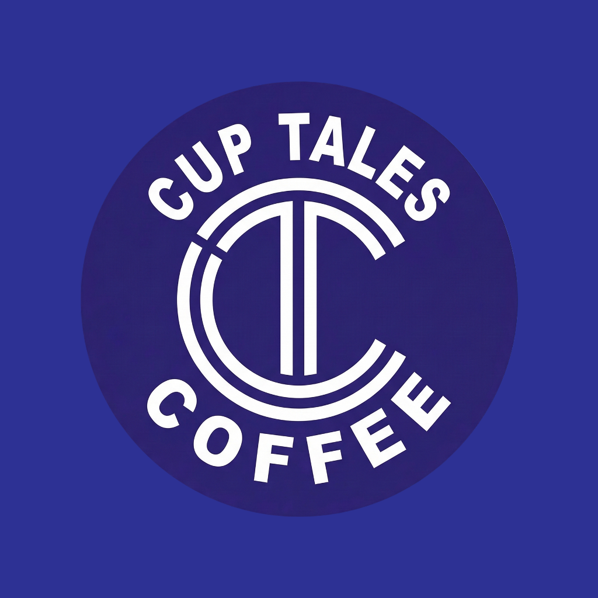

<div align="center">
  

  # Cup Tales

  **A polished café ordering experience for Android and iOS.**

  تطبيق كوب تيلز لتصفّح المنيو، إدارة السلة، وإرسال الطلبات بسهولة.

  
  
  
  
  
</div>

## About

Cup Tales is a production-focused Flutter application that turns the café menu
and ordering flow into a fast, localized mobile experience. The app combines a
clean Arabic-first interface with secure authentication, live product data,
cart management, order tracking, and customer notifications.

## Features

- Email/password authentication on Android and iOS
- Google Sign-In on Android
- Persistent sessions and automatic sign-in restoration
- Dynamic categories, products, and product details
- Cart quantity management and automatic total calculation
- Pickup, drive-thru, and home-delivery checkout flows
- Saved delivery addresses and mandatory verified-format phone numbers
- Daily ordering hours enforced in both the app and database
- Order history and status tracking
- Android push notifications through OneSignal
- Arabic localization and responsive mobile layouts
- Branded launcher icons and native splash experience
- Android 16 / API 36 support

## Technology Stack

| Area | Technology |
| --- | --- |
| Mobile | Flutter, Dart |
| Architecture | Feature-first, layered architecture |
| State management | BLoC / Cubit |
| Backend and database | Supabase, PostgreSQL |
| Authentication | Supabase Auth, Google Sign-In |
| Platform services | Firebase Core |
| Notifications | OneSignal |
| Networking | Dio, HTTP |
| Local storage | Hive, Shared Preferences |

## Project Structure

```text
lib/
├── core/                   # Shared config, services, theme, and widgets
├── features/
│   ├── auth/               # Login, registration, and session handling
│   ├── cart/               # Cart state and presentation
│   ├── categories/         # Category data and UI
│   ├── checkout/           # Checkout workflow
│   ├── home/               # Main customer experience
│   ├── orders/             # Order creation and history
│   ├── products/           # Product catalog and details
│   ├── profile/            # Customer profile
│   └── splash/             # Startup and routing
└── main.dart
```

## Current Release

| Property | Value |
| --- | --- |
| App version | `1.0.5` |
| Android version code | `6` |
| Android application ID | `com.cuptales.app` |
| Android target SDK | `36` |
| Minimum Android version | Android 7.0 / API 24 |

## Getting Started

### Prerequisites

- Flutter stable with Dart 3
- Android SDK 36 for Android builds
- Xcode and CocoaPods for iOS builds
- Supabase, Firebase, Google OAuth, and OneSignal project access

### Installation

```bash
git clone https://github.com/MohamedYousry22/Cup-Tales.git
cd Cup-Tales
flutter pub get
flutter run
```

Platform service files and identifiers must match the Firebase, Google OAuth,
Supabase, and OneSignal projects used by the target environment.

## Quality Checks

```bash
flutter analyze
flutter test
```

## Release Builds

```bash
# Android App Bundle
flutter build appbundle --release

# iOS archive prerequisites
flutter build ios --release
```

Android release signing values belong in `android/key.properties`. Keystores,
certificates, generated release artifacts, OAuth client-secret downloads, and
local environment files are intentionally excluded from version control.

## Store Support

- Privacy policy: https://mohamedyousry22.github.io/Cup-Tales/privacy-policy.html
- Account deletion: https://mohamedyousry22.github.io/Cup-Tales/delete-account.html
- Support: https://mohamedyousry22.github.io/Cup-Tales/support.html

## Contributors

- Anas Ayman El-Gebaili
- Mohamed Yousry

## License

This project is available under the [MIT License](LICENSE).
